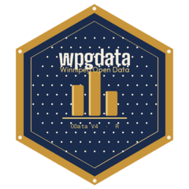

<!-- README.md is generated from README.Rmd. Please edit that file -->
```{r setup, include = FALSE}
knitr::opts_chunk$set(
  collapse  = TRUE,
  comment   = "#>",
  fig.path  = "man/figures/README-",
  out.width = "100%"
)
```

# wpgdata 

<!-- badges: start -->
[](https://CRAN.R-project.org/package=wpgdata)
[](https://lifecycle.r-lib.org/articles/stages.html#experimental)
[](https://github.com/myominnoo/wpgdata/actions/workflows/R-CMD-check.yaml)
[](https://opensource.org/licenses/MIT)
<!-- badges: end -->

`wpgdata` provides a simple R interface to query and download datasets
from the [City of Winnipeg Open Data Portal](https://data.winnipeg.ca)
using the OData V4 API.

## Installation

Install from CRAN:
```{r install_cran, eval = FALSE}
install.packages("wpgdata")
```

Or install the development version from GitHub:
```{r install_github, eval = FALSE}
# install.packages("pak")
pak::pak("myominnoo/wpgdata")
```

## Usage
```{r library, message = FALSE}
library(wpgdata)
```

The typical workflow follows these steps:
```
peg_catalogue()   →   peg_info()   →   peg_metadata()   →   peg_query()   →   peg_all()
(find datasets)       (explore)        (find fields)        (filter)          (download all)
```

### `peg_catalogue()` — find available datasets

List all datasets on the Winnipeg Open Data Portal with their IDs,
categories, and last updated dates:
```{r peg_catalogue, message = FALSE}
peg_catalogue()
```

Filter by category or search by name to find a dataset ID:
```{r peg_catalogue_filter, message = FALSE}
library(dplyr)

# count datasets by category
peg_catalogue() |>
  count(category, sort = TRUE)

# search by name
peg_catalogue() |>
  filter(grepl("assessment", name, ignore.case = TRUE)) |>
  select(name, id, updated_at)
```

### `peg_info()` — dataset-level information

Get high-level information about a dataset before downloading it:
```{r peg_info}
peg_info("d4mq-wa44")
```

### `peg_metadata()` — column names and types

Look up field names and types before querying. Always use `field_name`
values in `peg_query()`:
```{r peg_metadata}
peg_metadata("d4mq-wa44")
```

### `peg_get()` — fetch the first page

Fetch the first page of a dataset. Warns if more rows are available:
```{r peg_get, message = FALSE}
suppressWarnings(peg_get("d4mq-wa44"))
```

### `peg_query()` — filter, select, sort

Query a dataset using R expressions or raw OData strings:
```{r peg_query_filter}
# R expression filter
peg_query("d4mq-wa44",
  filter = total_assessed_value > 1000000,
  top    = 5
)
```
```{r peg_query_select}
# select specific columns
peg_query("d4mq-wa44",
  select = c("roll_number", "full_address", "total_assessed_value"),
  top    = 5
)
```
```{r peg_query_orderby}
# sort results
peg_query("d4mq-wa44",
  select  = c("roll_number", "full_address", "total_assessed_value"),
  orderby = "total_assessed_value desc",
  top     = 5
)
```
```{r peg_query_combined}
# combine filter + select + orderby
peg_query("d4mq-wa44",
  filter  = total_assessed_value > 1000000,
  select  = c("roll_number", "full_address", "total_assessed_value"),
  orderby = "total_assessed_value desc",
  top     = 5
)
```

### `peg_all()` — fetch all rows with pagination

Retrieve all rows across multiple pages with a progress bar:
```{r peg_all, message = FALSE}
peg_all("d4mq-wa44", max_pages = 3)
```

## OData Query Reference

| R expression | OData equivalent | Meaning |
|---|---|---|
| `x == 1` | `x eq 1` | equal |
| `x != 1` | `x ne 1` | not equal |
| `x > 1` | `x gt 1` | greater than |
| `x >= 1` | `x ge 1` | greater than or equal |
| `x < 1` | `x lt 1` | less than |
| `x <= 1` | `x le 1` | less than or equal |
| `x == 1 & y == 2` | `(x eq 1 and y eq 2)` | AND |
| `x == 1 \| y == 2` | `(x eq 1 or y eq 2)` | OR |
| `!x` | `not x` | NOT |

## Finding Dataset IDs

The easiest way is directly in R:
```{r find_id, eval = FALSE}
peg_catalogue() |>
  filter(grepl("your search term", name, ignore.case = TRUE)) |>
  select(name, id, category)
```

Alternatively, browse the
[City of Winnipeg Open Data Portal](https://data.winnipeg.ca) and
copy the ID from the OData V4 endpoint URL:
```
https://data.winnipeg.ca/api/odata/v4/d4mq-wa44
                                      ^^^^^^^^^^
                                      dataset ID
```

## License

MIT © [Myo Minn Oo](https://github.com/myominnoo)