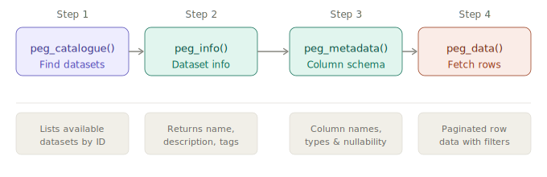

<!-- README.md is generated from README.Rmd. Please edit that file -->

```{r setup, include = FALSE}
knitr::opts_chunk$set(
  collapse  = TRUE,
  comment   = "#>",
  fig.path  = "man/figures/README-",
  out.width = "100%"
)
```

```{r pipeline-svg, include = FALSE}
svg_code <- '
<svg xmlns="http://www.w3.org/2000/svg" width="800" viewBox="0 0 680 220">
  <defs>
    <marker id="arrow" viewBox="0 0 10 10" refX="8" refY="5"
      markerWidth="6" markerHeight="6" orient="auto-start-reverse">
      <path d="M2 1L8 5L2 9" fill="none" stroke="#888780"
        stroke-width="1.5" stroke-linecap="round" stroke-linejoin="round"/>
    </marker>
  </defs>

  <!-- Step labels -->
  <text font-family="sans-serif" font-size="12" fill="#6b6a64" x="90"  y="22" text-anchor="middle">Step 1</text>
  <text font-family="sans-serif" font-size="12" fill="#6b6a64" x="250" y="22" text-anchor="middle">Step 2</text>
  <text font-family="sans-serif" font-size="12" fill="#6b6a64" x="430" y="22" text-anchor="middle">Step 3</text>
  <text font-family="sans-serif" font-size="12" fill="#6b6a64" x="590" y="22" text-anchor="middle">Step 4</text>

  <!-- Node 1: peg_catalogue() -->
  <rect x="20" y="34" width="140" height="60" rx="8"
    fill="#EEEDFE" stroke="#534AB7" stroke-width="0.75"/>
  <text font-family="sans-serif" font-size="13" font-weight="500" fill="#3C3489"
    x="90" y="60" text-anchor="middle" dominant-baseline="central">peg_catalogue()</text>
  <text font-family="sans-serif" font-size="12" fill="#534AB7"
    x="90" y="80" text-anchor="middle" dominant-baseline="central">Find datasets</text>

  <line x1="160" y1="64" x2="178" y2="64"
    stroke="#888780" stroke-width="1.5" fill="none" marker-end="url(#arrow)"/>

  <!-- Node 2: peg_info() -->
  <rect x="180" y="34" width="140" height="60" rx="8"
    fill="#E1F5EE" stroke="#0F6E56" stroke-width="0.75"/>
  <text font-family="sans-serif" font-size="13" font-weight="500" fill="#085041"
    x="250" y="60" text-anchor="middle" dominant-baseline="central">peg_info()</text>
  <text font-family="sans-serif" font-size="12" fill="#0F6E56"
    x="250" y="80" text-anchor="middle" dominant-baseline="central">Dataset info</text>

  <line x1="320" y1="64" x2="358" y2="64"
    stroke="#888780" stroke-width="1.5" fill="none" marker-end="url(#arrow)"/>

  <!-- Node 3: peg_metadata() -->
  <rect x="360" y="34" width="140" height="60" rx="8"
    fill="#E1F5EE" stroke="#0F6E56" stroke-width="0.75"/>
  <text font-family="sans-serif" font-size="13" font-weight="500" fill="#085041"
    x="430" y="60" text-anchor="middle" dominant-baseline="central">peg_metadata()</text>
  <text font-family="sans-serif" font-size="12" fill="#0F6E56"
    x="430" y="80" text-anchor="middle" dominant-baseline="central">Column schema</text>

  <line x1="500" y1="64" x2="518" y2="64"
    stroke="#888780" stroke-width="1.5" fill="none" marker-end="url(#arrow)"/>

  <!-- Node 4: peg_data() -->
  <rect x="520" y="34" width="140" height="60" rx="8"
    fill="#FAECE7" stroke="#993C1D" stroke-width="0.75"/>
  <text font-family="sans-serif" font-size="13" font-weight="500" fill="#712B13"
    x="590" y="60" text-anchor="middle" dominant-baseline="central">peg_data()</text>
  <text font-family="sans-serif" font-size="12" fill="#993C1D"
    x="590" y="80" text-anchor="middle" dominant-baseline="central">Fetch rows</text>

  <!-- Divider -->
  <line x1="20" y1="128" x2="660" y2="128" stroke="#D3D1C7" stroke-width="0.5"/>

  <!-- Description boxes -->
  <rect x="20"  y="140" width="140" height="52" rx="6" fill="#F1EFE8" stroke="#D3D1C7" stroke-width="0.5"/>
  <text font-family="sans-serif" font-size="11" fill="#6b6a64" x="90"  y="160" text-anchor="middle" dominant-baseline="central">Lists available</text>
  <text font-family="sans-serif" font-size="11" fill="#6b6a64" x="90"  y="176" text-anchor="middle" dominant-baseline="central">datasets by ID</text>

  <rect x="180" y="140" width="140" height="52" rx="6" fill="#F1EFE8" stroke="#D3D1C7" stroke-width="0.5"/>
  <text font-family="sans-serif" font-size="11" fill="#6b6a64" x="250" y="160" text-anchor="middle" dominant-baseline="central">Returns name,</text>
  <text font-family="sans-serif" font-size="11" fill="#6b6a64" x="250" y="176" text-anchor="middle" dominant-baseline="central">description, tags</text>

  <rect x="360" y="140" width="140" height="52" rx="6" fill="#F1EFE8" stroke="#D3D1C7" stroke-width="0.5"/>
  <text font-family="sans-serif" font-size="11" fill="#6b6a64" x="430" y="160" text-anchor="middle" dominant-baseline="central">Column names,</text>
  <text font-family="sans-serif" font-size="11" fill="#6b6a64" x="430" y="176" text-anchor="middle" dominant-baseline="central">types &amp; nullability</text>

  <rect x="520" y="140" width="140" height="52" rx="6" fill="#F1EFE8" stroke="#D3D1C7" stroke-width="0.5"/>
  <text font-family="sans-serif" font-size="11" fill="#6b6a64" x="590" y="160" text-anchor="middle" dominant-baseline="central">Paginated row</text>
  <text font-family="sans-serif" font-size="11" fill="#6b6a64" x="590" y="176" text-anchor="middle" dominant-baseline="central">data with filters</text>
</svg>
'

dir.create("man/figures", recursive = TRUE, showWarnings = FALSE)
writeLines(svg_code, "man/figures/README-pipeline.svg")
```

# wpgdata 

<!-- badges: start -->
[](https://CRAN.R-project.org/package=wpgdata)
[](https://lifecycle.r-lib.org/articles/stages.html#experimental)
[](https://github.com/myominnoo/wpgdata/actions/workflows/R-CMD-check.yaml)
[](https://opensource.org/licenses/MIT)
<!-- badges: end -->

`wpgdata` provides a tidy R interface to the
[City of Winnipeg Open Data Portal](https://data.winnipeg.ca). Discover
available datasets, inspect their schemas, and download records with
automatic parallel pagination — all via the Socrata OData V4 and
Discovery APIs.

## Installation

Install from CRAN:

```{r install_cran, eval = FALSE}
install.packages("wpgdata")
```

Or install the development version from GitHub:

```{r install_github, eval = FALSE}
# install.packages("pak")
pak::pak("myominnoo/wpgdata")
```

## Workflow

```{r library, message = FALSE}
library(wpgdata)
```

The package exposes four functions that follow a natural progression
from discovery to download:

```{r pipeline-chart, echo = FALSE, out.width = "100%"}

```

### `peg_catalogue()` — discover available datasets

List every dataset published on the Winnipeg Open Data Portal. Both
catalogue pages and per-dataset metadata are fetched in parallel, so
the full catalogue arrives in seconds rather than minutes.

```{r peg_catalogue, message = FALSE}
peg_catalogue()
```

Use `dplyr` to explore the catalogue:

```{r peg_catalogue_explore, message = FALSE}
library(dplyr)

# count datasets by category
peg_catalogue() |>
  count(category, sort = TRUE)

# find a dataset by name
peg_catalogue() |>
  filter(grepl("assessment", name, ignore.case = TRUE)) |>
  select(name, id, rows_updated_at)
```

Use `limit` to cap the number of datasets returned when exploring:

```{r peg_catalogue_limit, message = FALSE}
peg_catalogue(limit = 10)
```

### `peg_info()` — dataset-level information

Get high-level metadata for a single dataset before downloading it:

```{r peg_info}
peg_info("d4mq-wa44")
```

### `peg_metadata()` — column schema

Inspect column names and types. Use the `field_name` column in
`peg_data()` when filtering or selecting specific columns:

```{r peg_metadata}
peg_metadata("d4mq-wa44")
```

### `peg_data()` — fetch rows

Download rows from a dataset. All pages are fetched in parallel
automatically — no manual pagination needed.

**Fetch all rows:**

```{r peg_data_all, message = FALSE}
peg_data("d4mq-wa44")
```

**Limit rows with `top`:**

```{r peg_data_top, message = FALSE}
peg_data("d4mq-wa44", top = 5)
```

**Filter with R expressions:**

```{r peg_data_filter, message = FALSE}
peg_data("d4mq-wa44",
  filter = total_assessed_value > 1000000,
  top    = 5
)
```

**Select specific columns:**

```{r peg_data_select, message = FALSE}
peg_data("d4mq-wa44",
  select = c("roll_number", "full_address", "total_assessed_value"),
  top    = 5
)
```

**Sort results:**

```{r peg_data_orderby, message = FALSE}
peg_data("d4mq-wa44",
  select  = c("roll_number", "full_address", "total_assessed_value"),
  orderby = "total_assessed_value desc",
  top     = 5
)
```

**Combine filter, select, and orderby:**

```{r peg_data_combined, message = FALSE}
peg_data("d4mq-wa44",
  filter  = total_assessed_value > 1000000,
  select  = c("roll_number", "full_address", "total_assessed_value"),
  orderby = "total_assessed_value desc",
  top     = 5
)
```

**Skip rows** (useful for resuming or sampling):

```{r peg_data_skip, message = FALSE}
peg_data("d4mq-wa44", skip = 1000, top = 5)
```

## Finding dataset IDs

The easiest way is directly in R:

```{r find_id, eval = FALSE}
peg_catalogue() |>
  filter(grepl("your search term", name, ignore.case = TRUE)) |>
  select(name, id, category)
```

Alternatively, browse the
[City of Winnipeg Open Data Portal](https://data.winnipeg.ca) and copy
the ID from the dataset URL:

```
https://data.winnipeg.ca/d/d4mq-wa44
                            ^^^^^^^^^^
                            dataset ID
```

## OData filter reference

`peg_data()` accepts plain R expressions in the `filter` argument and
translates them to OData automatically. Raw OData strings are also
accepted for advanced use.

| R expression          | OData equivalent          | Meaning                  |
|-----------------------|---------------------------|--------------------------|
| `x == 1`              | `x eq 1`                  | equal                    |
| `x != 1`              | `x ne 1`                  | not equal                |
| `x > 1`               | `x gt 1`                  | greater than             |
| `x >= 1`              | `x ge 1`                  | greater than or equal    |
| `x < 1`               | `x lt 1`                  | less than                |
| `x <= 1`              | `x le 1`                  | less than or equal       |
| `x == 1 & y == 2`     | `(x eq 1 and y eq 2)`     | AND                      |
| `x == 1 \| y == 2`    | `(x eq 1 or y eq 2)`      | OR                       |
| `!x`                  | `not x`                   | NOT                      |

## License

MIT © [Myo Minn Oo](https://github.com/myominnoo)
